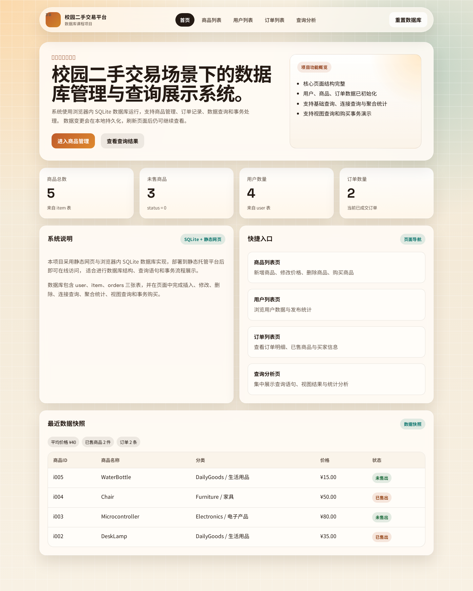
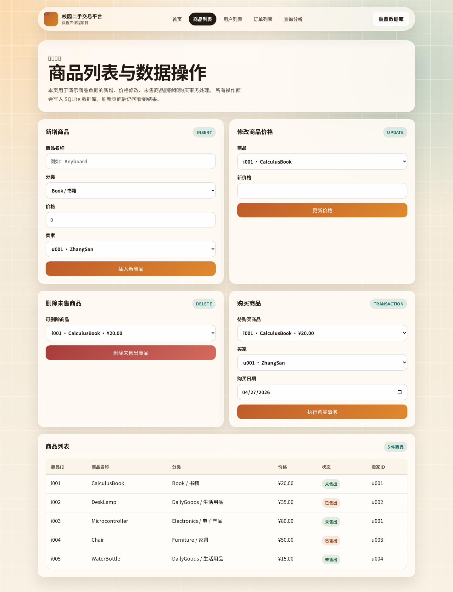

# 校园二手交易平台数据库系统项目说明

## 在线访问网址

最终在线网址：

```text
https://wimiw123.github.io/database_dut_wimiw/
```

建议把最终在线网址放在本文件最开头，方便老师打开。

## 一、项目简介

本项目根据《26 数据库大作业》要求，设计并实现了一个“校园二手交易平台数据库系统”。项目采用静态网页 + 浏览器内 SQLite 的方式实现，因此部署到静态托管平台后即可直接在线访问，无需额外后端运行环境。

项目共包含以下页面：

1. 首页 `index.html`
2. 商品列表页 `items.html`
3. 用户列表页 `users.html`
4. 订单列表页 `orders.html`
5. 查询分析页 `analysis.html`

## 二、技术方案

### 1. 前端实现

- HTML + CSS + JavaScript
- 多页面结构，导航清晰
- 所有页面共享同一套数据库逻辑

### 2. 数据库实现

- 使用 SQLite 作为数据库逻辑核心
- 通过 `sql.js` 在浏览器内运行 SQLite
- 使用 `localStorage` 持久化数据库二进制文件

### 3. 为什么满足“无需运行环境”

由于数据库直接运行在浏览器中，项目不需要后端服务即可进行数据展示、插入、修改、删除和查询。只要部署到 GitHub Pages、Netlify 等静态托管平台，就可以通过网址直接访问。

## 三、数据库设计

### 1. 表结构

数据库包含三张核心表：

- `user(user_id, user_name, phone)`
- `item(item_id, item_name, category, price, status, seller_id)`
- `orders(order_id, item_id, buyer_id, order_date)`

### 2. 完整性约束

- 主键约束：三张表均设置主键
- 非空约束：姓名、电话、商品名、价格、订单日期等字段不能为空
- 外键约束：
  - `item.seller_id -> user.user_id`
  - `orders.buyer_id -> user.user_id`
  - `orders.item_id -> item.item_id`
- `item.status` 只允许取值 `0` 或 `1`
- `orders.item_id` 设置唯一约束，保证一个商品最多被交易一次

### 3. 触发器设计

项目中使用触发器辅助保证一致性：

- 新订单插入后自动把对应商品状态更新为 `1`
- 已成交商品不能被改回未售出
- 已成交商品不能被删除

## 四、初始数据

### 1. 用户表

| user_id | user_name | phone |
| --- | --- | --- |
| u001 | ZhangSan | 13800000001 |
| u002 | LiSi | 13800000002 |
| u003 | WangWu | 13800000003 |
| u004 | ZhaoLiu | 13800000004 |

### 2. 商品表

| item_id | item_name | category | price | status | seller_id |
| --- | --- | --- | --- | --- | --- |
| i001 | CalculusBook | Book | 20 | 0 | u001 |
| i002 | DeskLamp | DailyGoods | 35 | 1 | u002 |
| i003 | Microcontroller | Electronics | 80 | 0 | u001 |
| i004 | Chair | Furniture | 50 | 1 | u003 |
| i005 | WaterBottle | DailyGoods | 15 | 0 | u004 |

### 3. 订单表

| order_id | item_id | buyer_id | order_date |
| --- | --- | --- | --- |
| o001 | i002 | u001 | 2024-05-01 |
| o002 | i004 | u002 | 2024-05-03 |

## 五、题目要求完成情况

### 1. 数据操作

项目支持并已实现以下操作：

- 插入一个新商品
- 修改某商品价格
- 删除一个未售出的商品
- 购买商品：新增订单并将商品状态改为已售出

这些操作全部真实写入 SQLite 数据库，刷新页面后仍能看到修改结果。

### 2. 基础查询

已实现：

1. 查询所有未售出的商品
2. 查询价格大于 30 的商品
3. 查询“生活用品”类商品
4. 查询 `u001` 发布的所有商品

### 3. 连接查询

已实现：

1. 查询所有已售商品及其买家姓名
2. 查询每个订单：商品名 + 买家名 + 日期
3. 查询卖家是 `u001` 的商品是否被购买

### 4. 聚合与分组

已实现：

1. 统计商品总数
2. 统计每类商品数量
3. 计算所有商品平均价格
4. 查询发布商品数量最多的用户

### 5. 视图

已创建：

1. `sold_item_view`：已售商品视图（商品名 + 买家 ID）
2. `unsold_item_view`：未售商品视图

### 6. 业务逻辑

“购买商品”采用事务方式实现：

1. 开启事务
2. 查询商品状态
3. 如果商品已售出则回滚并提示失败
4. 向 `orders` 表插入订单
5. 更新 `item` 表状态为 `1`
6. 提交事务

## 六、从运行代码到获得最终网址的步骤

### 方案一：本地预览

在项目根目录运行：

```bash
python -m http.server 8000
```

然后打开：

```text
http://127.0.0.1:8000/index.html
```

### 方案二：部署到 GitHub Pages

1. 将当前项目上传到 GitHub 仓库
2. 仓库中保持首页文件为 `index.html`
3. 打开 GitHub 仓库 `Settings -> Pages`
4. 选择部署分支，例如 `main`
5. 保存后等待 GitHub Pages 自动发布
6. 获得类似如下网址：

```text
https://你的用户名.github.io/仓库名/
```

### 方案三：部署到 Netlify

1. 登录 Netlify
2. 选择导入项目或直接拖拽项目目录
3. 因为本项目是纯静态站点，所以无需配置构建命令
4. 发布后获得一个可直接访问的网址

## 七、网页截图与运行结果截图

如果已完成截图，可将下列图片放入 `docs/screenshots/` 目录并直接随文档一起提交。

如需自动生成截图，可在本地静态服务运行后执行：

```bash
python scripts/capture_screenshots.py
```

建议至少保留以下截图：

1. 首页
2. 商品列表页
3. 新增商品操作前后对比
4. 修改商品价格前后对比
5. 删除未售商品前后对比
6. 购买商品成功后的结果
7. 用户列表页
8. 订单列表页
9. 查询分析页中的基础查询结果
10. 查询分析页中的连接查询、聚合查询、视图结果

可在此处插入图片，例如：

```markdown


```

## 八、安全性说明

### 1. 如何防止普通用户删除数据

如果是正式系统，可以采用“角色权限控制”：

- 管理员账号才拥有插入、删除、修改权限
- 普通用户只能浏览商品和订单信息
- 后端接口需要校验登录身份和角色

本项目是课程作业的静态展示版本，因此通过页面功能设计限制普通展示页面只做查询，把删除和购买操作集中放在商品管理区域，用于演示数据库功能。

### 2. 如何限制用户只能查询数据

可以采用以下方式：

- 数据库层只授予用户 `SELECT` 权限，不授予 `INSERT/UPDATE/DELETE`
- 接口层按角色开放功能
- 前端隐藏无权限按钮
- 审计日志记录敏感操作

## 九、并发与恢复说明

### 1. 两个用户同时购买同一商品会出现什么问题

如果没有事务和并发控制，两个用户可能同时读取到商品为“未售出”，从而都尝试提交订单，导致同一商品被重复购买。

### 2. 如何解决

可以使用以下机制：

- 使用事务把“检查状态 + 插入订单 + 更新状态”包成一个整体
- 在数据库中对 `orders.item_id` 设置唯一约束
- 使用加锁机制或串行化事务，保证同一时刻只有一个事务能成功提交

本项目已经通过事务逻辑和 `orders.item_id UNIQUE` 共同避免重复购买。

### 3. 如果系统崩溃，如何恢复订单数据

实际系统中可以采用：

- 数据库定期备份
- 使用事务日志或 WAL 日志恢复未完成事务
- 关键订单数据落盘后再确认支付成功
- 发生故障后从最近一次备份恢复，并结合日志补齐订单

## 十、附加说明

- SQL 脚本位于 `sql/` 目录
- 查询语句样例位于 `sql/queries.sql`
- 页面支持“重置数据库”按钮，便于录制演示视频
- 为了方便部署，项目没有依赖后端环境
