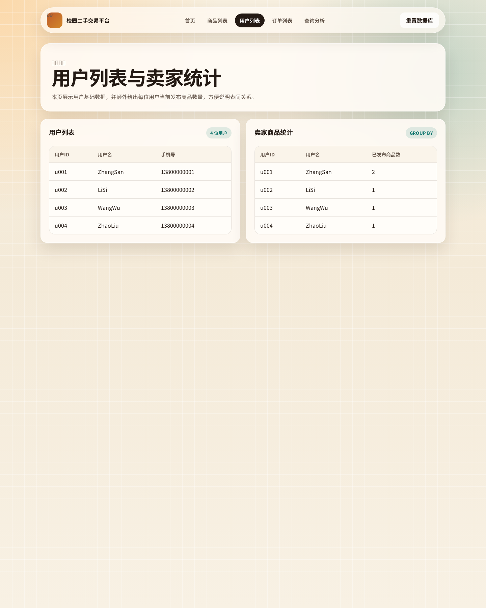
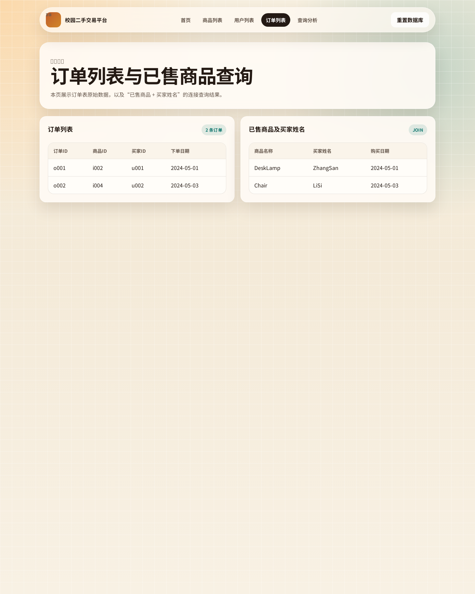
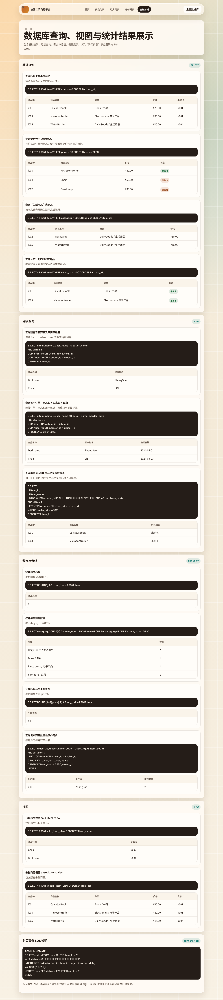
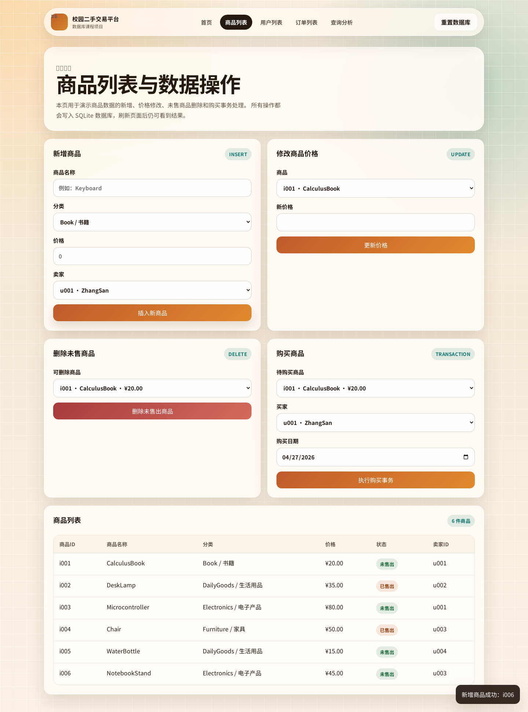
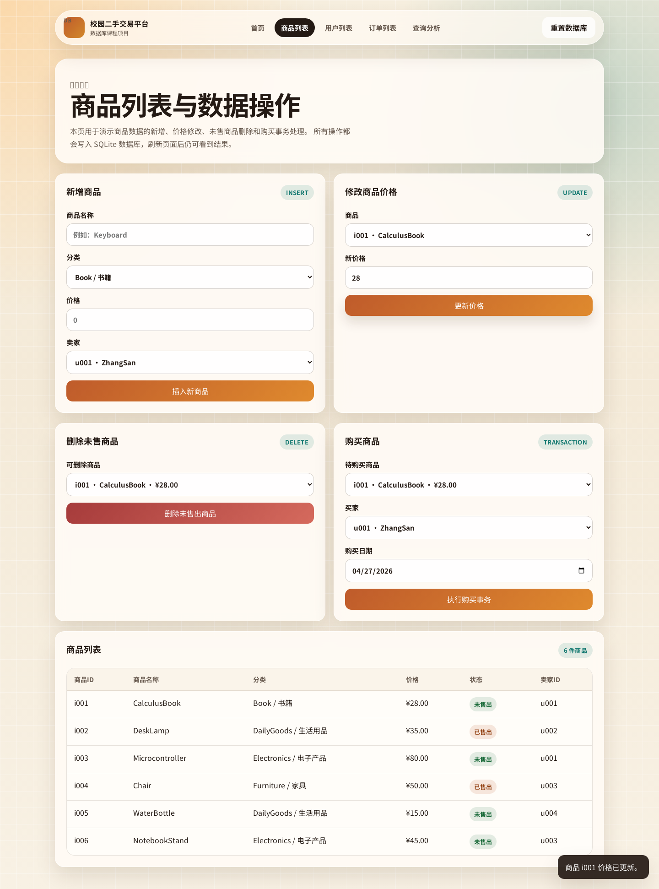
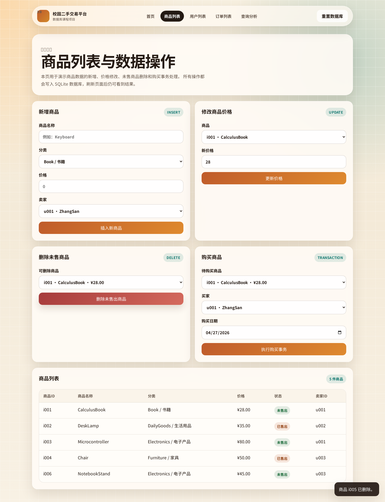
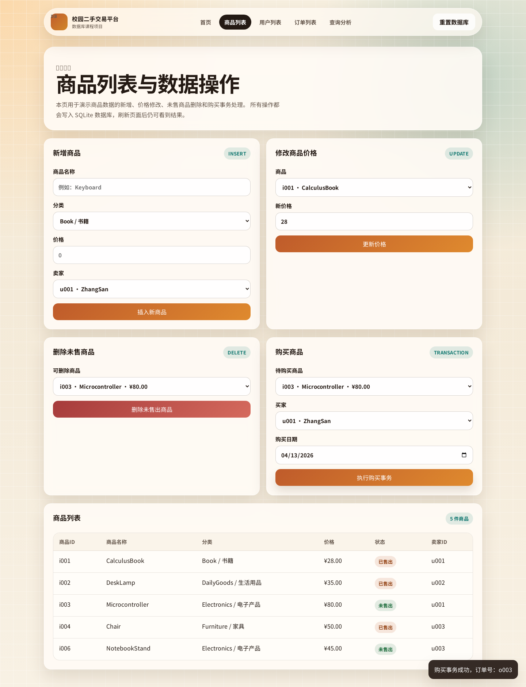

# 在线访问网址

```text
https://wimiw123.github.io/database_dut_wimiw/
```

# 校园二手交易平台数据库系统项目说明

本文件为提交材料中的“内容二：项目说明文件”。项目主题为“校园二手交易平台数据库系统”，采用静态网页 + 浏览器内 SQLite 的方式实现，可以直接部署到 GitHub Pages、Netlify 等静态托管平台，无需单独后端服务器。

## 一、项目简介

本项目围绕校园二手交易场景设计数据库系统，实现用户、商品、订单三类核心数据的管理，并在网页中展示数据库查询、视图、聚合统计和购买事务。

项目包含 5 个网页：

1. `index.html`：首页，展示系统说明、统计数据和入口。
2. `items.html`：商品列表页，支持新增商品、修改价格、删除未售商品、购买商品。
3. `users.html`：用户列表页，展示用户信息和卖家发布商品统计。
4. `orders.html`：订单列表页，展示订单数据和“已售商品 + 买家姓名”的连接查询结果。
5. `analysis.html`：查询分析页，集中展示基础查询、连接查询、聚合查询、视图和购买事务 SQL。

## 二、技术方案

前端使用 HTML、CSS、JavaScript 实现多页面静态网站。数据库使用 SQLite，并通过 `sql.js` 在浏览器内运行，数据库文件导出为二进制数据后保存到 `localStorage`，因此页面刷新后数据变化仍然保留。

核心文件说明：

1. `sql/schema.sql`：创建 `user`、`item`、`orders` 三张表，设置主键、外键、唯一约束、检查约束、索引和触发器。
2. `sql/seed.sql`：插入初始用户、商品和订单数据。
3. `sql/views.sql`：创建已售商品视图和未售商品视图。
4. `sql/queries.sql`：保存基础查询、连接查询、聚合查询、视图查询和事务示例 SQL。
5. `assets/js/db.js`：封装数据库初始化、查询、执行、事务、持久化等逻辑。
6. `assets/js/main.js`：负责页面渲染和表单交互。

## 三、数据库设计

数据库包含三张核心表：

| 表名 | 作用 | 主要字段 |
| --- | --- | --- |
| `user` | 存储用户信息 | `user_id`、`user_name`、`phone` |
| `item` | 存储商品信息 | `item_id`、`item_name`、`category`、`price`、`status`、`seller_id` |
| `orders` | 存储订单信息 | `order_id`、`item_id`、`buyer_id`、`order_date` |

主要完整性约束：

1. 三张表均设置主键。
2. `item.seller_id` 外键引用 `user.user_id`。
3. `orders.item_id` 外键引用 `item.item_id`。
4. `orders.buyer_id` 外键引用 `user.user_id`。
5. `orders.item_id` 设置 `UNIQUE`，保证同一商品最多只能生成一条订单。
6. `item.status` 只允许为 `0` 或 `1`，其中 `0` 表示未售出，`1` 表示已售出。
7. 商品价格设置 `CHECK (price >= 0)`，防止出现负价格。

触发器设计：

1. 插入订单后自动把对应商品状态更新为已售出。
2. 已成交商品不能改回未售出。
3. 已成交商品不能被删除。

## 四、初始数据

初始用户数据：

| user_id | user_name | phone |
| --- | --- | --- |
| u001 | ZhangSan | 13800000001 |
| u002 | LiSi | 13800000002 |
| u003 | WangWu | 13800000003 |
| u004 | ZhaoLiu | 13800000004 |

初始商品数据：

| item_id | item_name | category | price | status | seller_id |
| --- | --- | --- | --- | --- | --- |
| i001 | CalculusBook | Book | 20 | 0 | u001 |
| i002 | DeskLamp | DailyGoods | 35 | 1 | u002 |
| i003 | Microcontroller | Electronics | 80 | 0 | u001 |
| i004 | Chair | Furniture | 50 | 1 | u003 |
| i005 | WaterBottle | DailyGoods | 15 | 0 | u004 |

初始订单数据：

| order_id | item_id | buyer_id | order_date |
| --- | --- | --- | --- |
| o001 | i002 | u001 | 2024-05-01 |
| o002 | i004 | u002 | 2024-05-03 |

## 五、功能完成情况

数据操作功能：

1. 新增商品：向 `item` 表插入一条新商品记录。
2. 修改商品价格：对指定商品执行 `UPDATE`。
3. 删除未售商品：只允许删除 `status = 0` 的商品。
4. 购买商品：开启事务，检查商品状态，插入订单并更新商品状态。

查询功能：

1. 基础查询：未售商品、价格大于 30 的商品、生活用品类商品、`u001` 发布的商品。
2. 连接查询：已售商品及买家姓名、订单详情、`u001` 发布商品的购买状态。
3. 聚合与分组：商品总数、每类商品数量、平均价格、发布商品数量最多的用户。
4. 视图查询：`sold_item_view` 和 `unsold_item_view`。

购买事务逻辑：

```sql
BEGIN IMMEDIATE;
SELECT status FROM item WHERE item_id = ?;
-- 如果商品不存在或已售出，则 ROLLBACK
INSERT INTO orders(order_id, item_id, buyer_id, order_date)
VALUES (?, ?, ?, ?);
UPDATE item SET status = 1 WHERE item_id = ?;
COMMIT;
```

## 六、从运行代码到获得最终网址的具体步骤

1. 打开项目根目录：

```bash
cd /home/wimiw/database-work
```

2. 本地启动静态服务：

```bash
python -m http.server 8000
```

3. 在浏览器中访问本地页面：

```text
http://127.0.0.1:8000/index.html
```

4. 本地检查 SQL 和事务是否正常：

```bash
python scripts/validate_project.py
```

5. 将项目推送到 GitHub 仓库：

```bash
git add .
git commit -m "complete database course project"
git push origin main
```

6. 在 GitHub 仓库中开启 Pages：

```text
Settings -> Pages -> Build and deployment -> Deploy from a branch
```

7. 选择部署分支和目录：

```text
Branch: main
Folder: / (root)
```

8. 保存后等待 GitHub Pages 自动部署。由于本项目的 `index.html` 位于根目录，不需要构建命令，部署完成后即可得到最终在线网址：

```text
https://wimiw123.github.io/database_dut_wimiw/
```

如果使用 Netlify，也可以直接导入本仓库。项目中的 `netlify.toml` 已设置 `publish = "."`，无需额外构建命令。

## 七、网页截图与运行结果截图

截图文件已保存到 `docs/screenshots/` 目录。以下图片路径相对于本说明文件有效。

### 1. 全部网页截图

首页截图：展示在线项目入口、系统说明、统计卡片和最近数据快照。


商品列表页截图：展示新增、修改、删除、购买表单，以及当前商品表数据。


用户列表页截图：展示用户表数据和每个用户发布商品数量统计。



订单列表页截图：展示订单表原始数据，以及已售商品和买家姓名的连接查询结果。



查询分析页截图：展示基础查询、连接查询、聚合查询、视图查询和购买事务 SQL 说明。



### 2. 每类任务运行结果截图

操作前商品页截图：用于对比后续插入、修改、删除、购买操作前的数据状态。


新增商品结果截图：插入商品 `NotebookStand`，页面提示新增成功，商品列表中出现新记录。



修改商品价格结果截图：将商品 `i001` 的价格修改为 `28`，商品列表中的价格同步更新。



删除未售商品结果截图：删除未售出的商品 `i005`，商品列表中不再显示该商品。



购买商品结果截图：用户 `u004` 购买商品 `i001`，页面提示购买事务成功，商品状态更新为已售出。



查询任务结果说明：基础查询、连接查询、聚合查询、视图查询都集中展示在 `analysis.png` 中；订单连接查询也展示在 `orders.png` 中。

## 八、安全性

### 1. 如何防止普通用户删除数据

正式系统中应使用角色权限控制防止普通用户删除数据。普通用户登录后只拥有查看权限，不能调用删除接口；管理员或商品发布者经过身份校验后，才可以执行指定范围内的删除操作。

数据库层面可以不给普通用户授予 `DELETE` 权限，只授予必要的 `SELECT` 权限。接口层面需要校验登录用户身份、角色和资源归属，例如只有管理员或商品卖家才能删除未售出的商品。前端隐藏删除按钮只能改善体验，不能作为真正安全边界。

本项目是静态课程演示版本，页面上只允许选择未售商品执行删除；数据库中还通过触发器禁止删除已成交商品，从而避免订单数据和商品状态不一致。

### 2. 如何限制用户只能查询数据

正式系统中可以从三层限制用户只能查询数据：

1. 数据库层：为普通账号只授予 `SELECT` 权限，不授予 `INSERT`、`UPDATE`、`DELETE` 权限。
2. 接口层：普通用户只能访问查询接口，例如商品列表、订单查询等接口；写入类接口必须校验角色。
3. 前端层：普通用户页面只展示查询入口，不展示新增、修改、删除按钮。

其中最关键的是数据库层和接口层权限控制，因为前端按钮可以被绕过，不能单独依赖前端实现安全限制。

## 九、并发与恢复

### 1. 两个用户同时购买同一商品会出现什么问题

如果没有事务和并发控制，两个用户可能同时读取到同一商品的状态都是“未售出”，然后同时提交购买请求，最终导致一个商品生成两条订单，也就是超卖或重复购买问题。

### 2. 如何解决

解决办法是把“检查商品状态、插入订单、更新商品状态”放到同一个事务中执行，并在数据库中增加约束和锁控制。

本项目中的做法包括：

1. 使用 `BEGIN IMMEDIATE` 开启事务。
2. 在事务中先检查商品是否仍为未售出。
3. 插入订单后更新商品状态为已售出。
4. `orders.item_id` 设置 `UNIQUE`，从数据库层保证同一商品只能出现一次订单。
5. 如果任一步失败则执行回滚，保证订单表和商品表不会出现一边成功、一边失败的情况。

正式多用户系统中还可以使用行级锁、悲观锁、乐观锁或串行化事务隔离级别，保证同一商品同一时刻只有一个购买事务能够成功提交。

### 3. 如果系统崩溃，如何恢复订单数据

正式数据库系统通常通过事务日志或 WAL 机制恢复数据。系统重启后，数据库会根据日志把已经提交的订单事务重做，把尚未提交完成的事务回滚，从而保证订单数据不会处于半完成状态。

同时还应定期备份数据库，特别是 `orders` 表和 `item` 表。如果数据库文件损坏，可以先恢复最近一次备份，再根据事务日志或业务日志补齐备份之后已经成功提交的订单。

本项目是浏览器内 SQLite 演示版本，数据主要持久化在浏览器 `localStorage` 中。课程演示时如果需要恢复初始数据，可以点击“重置数据库”，系统会重新加载 `schema.sql`、`seed.sql`、`views.sql`；如果是正式系统，则应使用服务器端数据库、事务日志和定期备份来恢复订单数据。
